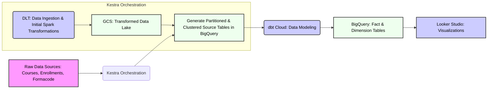

```mermaid
graph LR
    A[Raw Data Sources: Courses, Enrollments, Formacode] --> K(Kestra Orchestration);

    subgraph Kestra Orchestration
        B(DLT: Data Ingestion & Initial Spark Transformations) --> C[GCS: Transformed Data Lake];
        C --> D[Generate Partitioned & Clustered Source Tables in BigQuery];
    end

    K --> D;
    D --> E(dbt Cloud: Data Modeling);
    E --> F[BigQuery: Fact & Dimension Tables];
    F --> G[Looker Studio: Visualizations];

    style A fill:#f9f,stroke:#333,stroke-width:2px,color:#000;
    style B fill:#ccf,stroke:#333,stroke-width:2px,color:#000;
    style C fill:#efe,stroke:#333,stroke-width:2px,color:#000;
    style D fill:#efe,stroke:#333,stroke-width:2px,color:#000;
    style E fill:#ccf,stroke:#333,stroke-width:2px,color:#000;
    style F fill:#efe,stroke:#333,stroke-width:2px,color:#000;
    style G fill:#ccf,stroke:#333,stroke-width:2px,color:#000;
```
