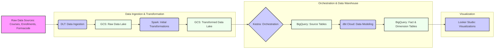

```mermaid
graph LR
    A[Raw Data Sources: Courses, Enrollments, Formacode] --> B(DLT: Data Ingestion);
    B --> C[GCS: Raw Data Lake];
    C --> D(Spark: Initial Transformations);
    D --> E[GCS: Transformed Data Lake];
    E --> F{Kestra: Orchestration};
    F --> G[BigQuery: Source Tables];
    G --> H(dbt Cloud: Data Modeling);
    H --> I[BigQuery: Fact & Dimension Tables];
    I --> J[Looker Studio: Visualizations];

    subgraph Data Ingestion & Transformation
        B; C; D; E;
    end

    subgraph Orchestration & Data Warehouse
        F; G; H; I;
    end

    subgraph Visualization
        J;
    end

    style A fill:#f9f,stroke:#333,stroke-width:2px;
    style B fill:#ccf,stroke:#333,stroke-width:2px;
    style C fill:#efe,stroke:#333,stroke-width:2px;
    style D fill:#ccf,stroke:#333,stroke-width:2px;
    style E fill:#efe,stroke:#333,stroke-width:2px;
    style F fill:#ccf,stroke:#333,stroke-width:2px;
    style G fill:#efe,stroke:#333,stroke-width:2px;
    style H fill:#ccf,stroke:#333,stroke-width:2px;
    style I fill:#efe,stroke:#333,stroke-width:2px;
    style J fill:#ccf,stroke:#333,stroke-width:2px;
```
